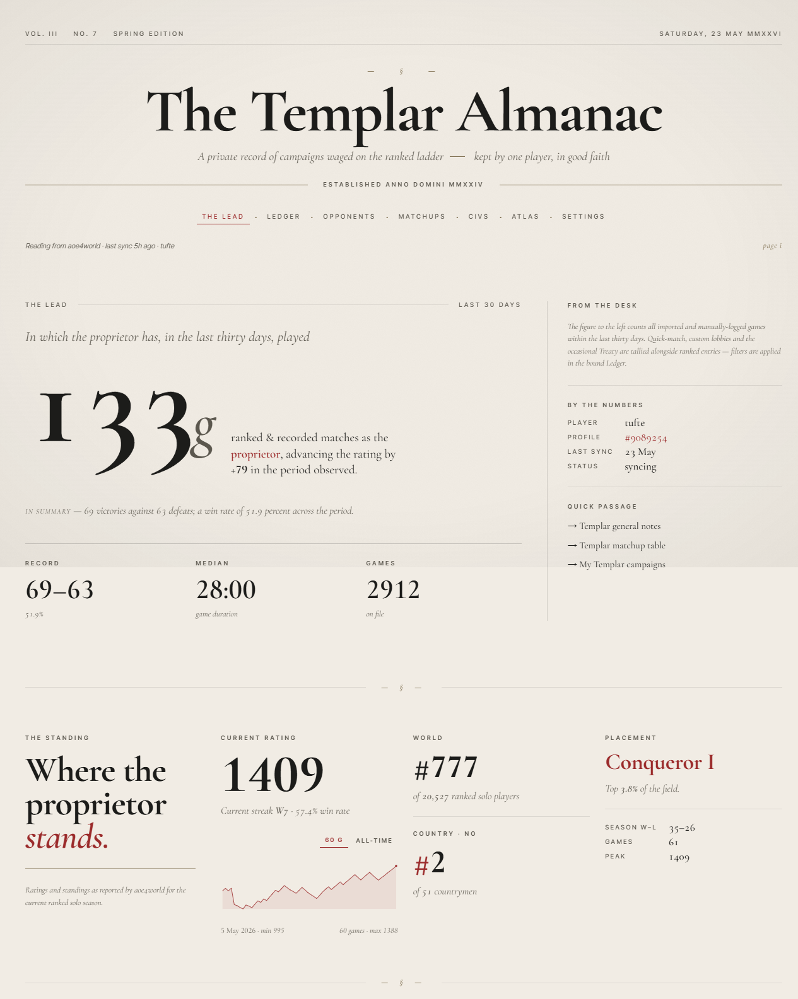
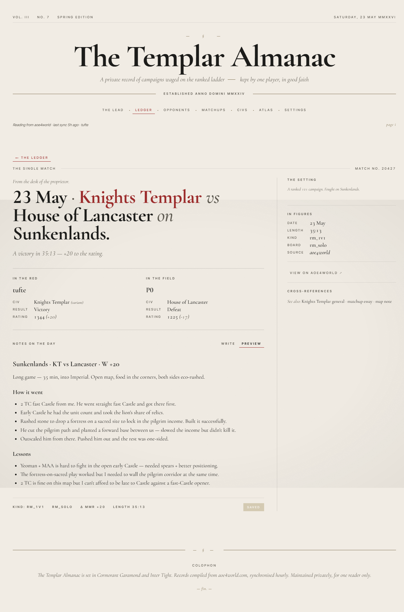
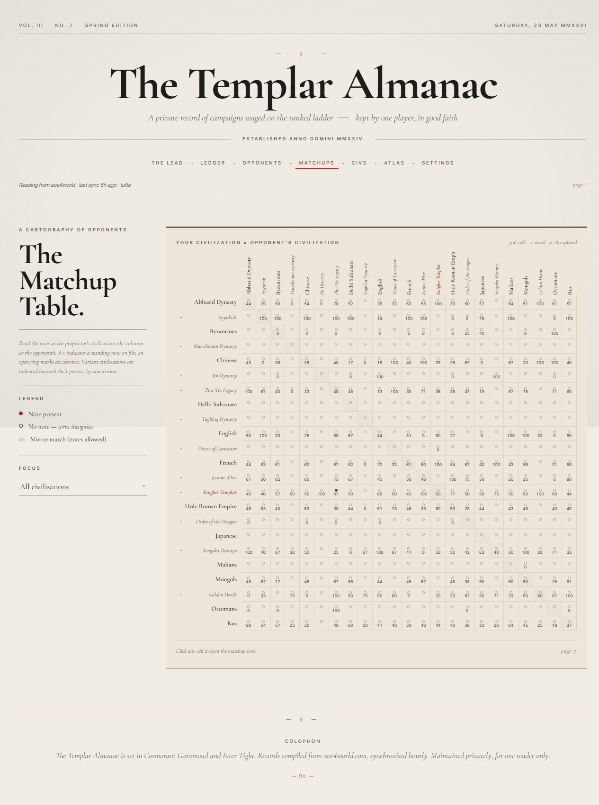

# aoe4-almanac

A local-first, single-player web app for keeping a careful record of your Age of Empires IV career. Ranked games are auto-imported from [aoe4world.com](https://aoe4world.com); custom games are entered by hand; notes hang off civs, matchups, maps, and individual games.

The UI is styled as a leather-bound almanac — serif typography on parchment, designed to feel like a personal campaign journal rather than a stats dashboard. Demo screenshots below are from the live app running against my own aoe4world profile (`tufte`, Knights Templar main).

---

## Demo

### Dashboard — "The Templar Almanac"

The landing page sets the tone: lifetime W/L, rating sparkline + current rank, and the most recent games rendered as a ledger.



### Single game — with notes

Every imported game gets its own detail page: both sides, rating delta, a deep-link to the aoe4world match, cross-references to the relevant civ/matchup/map notes, and a per-game markdown pad. Below is an actual KT-vs-Lancaster win on Sunkenlands with a written-up review.



> A note on the source data: aoe4world's public API exposes match metadata (civs, result, MMR, duration) but **not** build orders, resource graphs, or any timeline analysis — so the notes here are written by hand based on memory of the game, not auto-generated.

### Matchup table — 23 × 23 grid

Every civ vs every civ. Green numbers are W–L records pulled from your actual play history; dots mark cells where you have written notes. Variant civs (Knights Templar, Zhu Xi's Legacy, Order of the Dragon, House of Lancaster, Jeanne d'Arc, Ayyubids) are grouped under their parent.



---

## Features

- **aoe4world sync**: initial backfill on link + 60 s polling while the app is open. Rate-limited client (30 req/min, single-flight mutex, exponential backoff on 429). Live progress over Server-Sent Events.
- **Four kinds of notes**, all markdown, all PUT-upsert idempotent: per-civ, per-matchup (ordered pair — `templar→mongols` ≠ `mongols→templar`), per-map, per-game.
- **Variant civ awareness**: KT, Zhu Xi's, OotD, etc. are treated as fully distinct civs everywhere notes can attach, but grouped under their parent civ in the matchup grid and linked via "See also".
- **Opponents browser** with per-opponent ledger.
- **Stats**: W/L by civ, by map, by matchup, recent rating history sparkline.
- **Civ slug normalization**: aoe4world's short slugs (`templar`, `hre`, `zhuxi`) are aliased to canonical IDs (`knights_templar`, `holy_roman_empire`, `zhu_xis_legacy`) at ingest. Slugs never surface in the UI.
- **Multi-user-ready schema** (every row carries `user_id`, sessions table exists, auth middleware is a single swap point) even though the only user today is the seeded `local` one.

---

## Run locally

Requires Node ≥ 20 and pnpm 10.

```bash
pnpm install
pnpm db:migrate
pnpm db:seed
pnpm dev
```

That launches Vite on http://localhost:5173 and the Hono API on http://localhost:3001 (Vite proxies `/api` so there's no CORS).

1. Open http://localhost:5173/settings
2. Search your aoe4world player name, pick your profile, hit **Link**
3. Backfill kicks off automatically; the panel shows live progress
4. Browse `/games`, `/notes/matchups`, `/opponents`, etc.

The SQLite database lives at `~/.aoe4-almanac/data.db` (override with `AOE4_ALMANAC_DB_PATH`).

### Other scripts

```bash
pnpm typecheck            # tsc --noEmit across all workspaces
pnpm lint                 # oxlint
pnpm fmt                  # oxfmt
pnpm db:generate          # drizzle-kit generate
pnpm db:audit-civ-slugs   # surface any unknown civ slugs from sync payloads
pnpm build                # build shared + web + server
```

---

## Stack

- pnpm workspaces monorepo
- **Frontend** (`apps/web`): React 19 + Vite 8 + TypeScript, TanStack Router (file-based), TanStack Query, Tailwind v4
- **Backend** (`apps/server`): Hono on Node, better-sqlite3 + Drizzle ORM, OpenTelemetry tracing
- **Shared** (`packages/shared`): zod schemas for end-to-end types
- **Tooling**: oxlint + oxfmt

See [`plans/aoe4-almanac.md`](plans/aoe4-almanac.md) for the full design doc, decisions log, and progress tracker.
